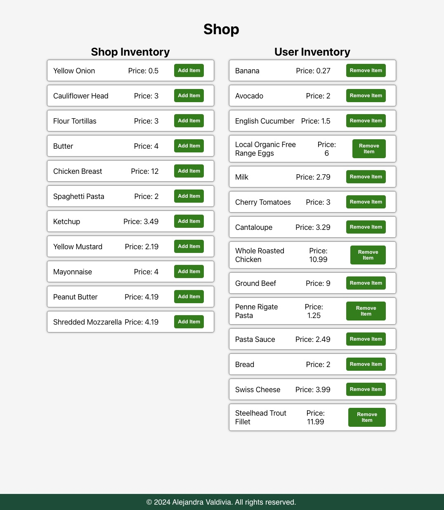

## React Shopping Cart

This is a React Shopping Cart example.

## Installation
Clone the repository https://github.com/AlejandraValdivia/react-shopping-cart and install the dependencies `npm install`. `npm run dev` will start the development server. Go to http://localhost:5173/ to see the app. 

Click on "Add item" to add an item to the User Inventory(user's shopping cart).

Click on "Remove item" to remove an item from the User Inventory.

